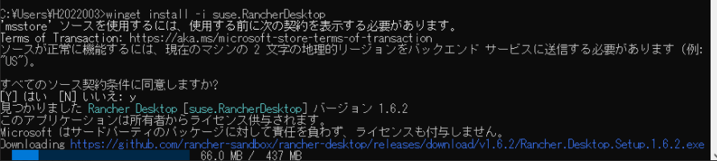
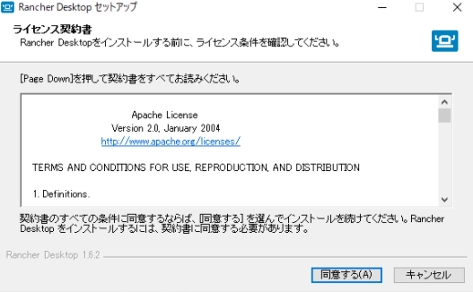
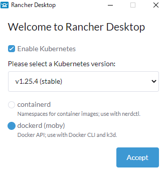
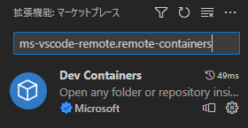

# devcontainer の利用方法

## 環境

| tool               | version | description                              | note                                                              |
| ------------------ | ------- | ---------------------------------------- | ----------------------------------------------------------------- |
| docker             | latest? | RancherDesktop で dockerd を使用している | `winget install -i suse.RancherDesktop` で導入可能(Windows)       |
| Visual Studio Code | latest  | コードエディタ(推奨)                     | `winget install -i Microsoft.VisualStudioCode`で導入可能(Windows) |

## 起動方法

1. WSL2 をインストールする

- 公式の手順に従ってください
  - <https://learn.microsoft.com/ja-jp/windows/wsl/install>
    ※コマンドプロンプトは管理者モードで実行する

2. winget をインストールする(手順 3 以降を winget 経由ではなく手動でインストールするする場合は不要です)

- <https://learn.microsoft.com/ja-jp/windows/package-manager/winget/>
  - アプリインストーラーを取得する
  - MicrosoftStore が存在しない場合(以下を参照)
    - <https://answers.microsoft.com/ja-jp/windows/forum/all/microsoft/7d0a8ba4-cf3d-45ba-a1dd-3b0a49c85d48>

3. docker(Rancher Desktop)をインストールする

- `winget install -i suse.RancherDesktop`で Rancher Desktop をインストールします。

  - インストール中の画面(基本的に規約等には同意する)
    

    - 同意を求められるため、同意するを押下  
      

  - インストール後は`Container Engine`を`containerd`から`dockerd`に変更します。
    - 一度 PC が再起動された後、手動で RancherDesktop を起動
      - RancherDesktop 初回起動画面(この画面で上記の変更を行う)  
        

4. Visual Studio Code をインストールする

- `winget install -i Microsoft.VisualStudioCode`で VSCode をインストールします。

5. 拡張機能をインストールする

- `ms-vscode-remote.remote-containers`の拡張機能をインストールします。
- 拡張機能から検索しても OK
  - 検索結果画面  
    
  - CLI でインストールしても OK
    - `code --install-extension ms-vscode-remote.remote-containers`

6. devcontainer を開く

- 左下の`><`マークをクリックし、`Reopen in Container`を選んで devcontainer を起動する。(起動には 5 分程度かかる)
