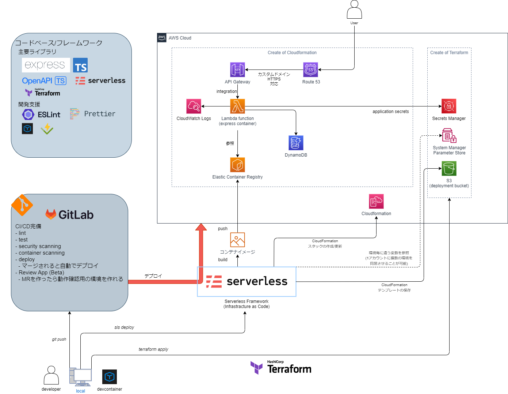

# FaaS シードプロジェクト TypeScript 1.0.0

## このリポジトリについて

本アセットはAWS Lambdaを使用したアプリケーションを簡単に作成するためのものです
使用方法については[ユースケース](./docs/usecase/index.md)を参照してください

ここではリポジトリの環境や構成についてざっくりと説明しています。  
アプリ開発者向けの詳細なトレーニングは`docs/training`をご覧ください。(執筆中)

### 技術要件

本アセットを利用する際には以下に関する知識が必要です
- serverless framework の使い方
- Typescript の書き方

### アセットの開発に参加したい場合

開発に参加したい場合の詳細については[コントリビュートガイド](./docs/guideline/ContributeGuide.md)を参照してください

### 環境

| tool               | version | description                    | note                                                                  |
| ------------------ | ------- | ------------------------------ | --------------------------------------------------------------------- |
| node               | 20.\*   | JavaScript の実行環境          | LTS(Iron)の最新版, ローカルでは`nvm` を使用して導入することを推奨 |
| Visual Studio Code | latest  | コードエディタ(推奨)           | `winget install -i Microsoft.VisualStudioCode`で導入可能(Windows)     |
| Stoplight Studio   | 2.10.0  | OpenAPI のエディタ(オプション) | アカウント登録等が必要です                                            |

## 初期設定

### devcontainer で起動することを強く推奨します(下記参照)

- [.devcontainer/README.md](.devcontainer/README.md)

## 使用ライブラリ

### 主要ライブラリ

- [TypeScript](https://www.typescriptlang.org/): 開発言語
  - [@tsconfig/bases](https://github.com/tsconfig/bases): tsconfig のプリセット
- [Express](https://expressjs.com/): バックエンドフレームワーク
  - compression
  - cors
  - body-parser
- [serverless-Express](https://github.com/vendia/serverless-express): FaaS 用に Express を動作させるラッパーライブラリ
- [express-openapi](https://www.npmjs.com/package/express-openapi): OpenAPI と Express の統合ライブラリ
- [openapi-typescript](https://openapi-ts.pages.dev/introduction/): OpenAPI 定義から TypeScript の型に変換するライブラリ
- [log4js](https://www.npmjs.com/package/log4js): Logger ライブラリ

### IaC ツール

- [Serverless Framework](https://www.serverless.com/framework/): サーバレスなアーキテクチャでクラウドサービスを作るのに特化した IaC ツール
  - [serverless-deployment-bucket](https://www.serverless.com/plugins/serverless-deployment-bucket): デプロイバケット設定用プラグイン
  - [serverless-domain-manager](https://www.serverless.com/plugins/serverless-domain-manager): カスタムドメイン設定用プラグイン
  - [serverless-plugin-resource-tagging](https://www.serverless.com/plugins/serverless-plugin-resource-tagging): 一括タグ付けを可能にするプラグイン

### 開発支援

- [ESLint](https://eslint.org/): Linter
  - [TypeScript ESLint](https://typescript-eslint.io/)
- [Prettier](https://prettier.io/): Formatter

### テスト

- [Vitest](https://vitest.dev/): テストフレームワーク
  - @vitest/coverage-v8: カバレッジツール

### ローカル開発向け

- [cross-env](https://github.com/kentcdodds/cross-env)
- [dotenv](https://github.com/motdotla/dotenv)
- [nodemon](https://nodemon.io/)
- [tsc-alias](https://github.com/justkey007/tsc-alias)
- [tsx](https://github.com/esbuild-kit/tsx)

## ソースコード等について

### 思想

- Type Safe(型安全)
- Schema First(スキーマ駆動)
- GitOps
- DevOps
- NoOps
- Infrastructure as Code
- DRY 原則(Don't repeat yourself)

### 言語など

- 言語

  - TypeScript
    - ES module
      - 通常広く使われている commonjs とは異なる可能性がある
      - TypeScript でコーディングする場合はさほど気にしなくて良いです
      - 異なる点の例
        - `__filename`や`__dirname`が、定義されていない

- 例）`__filename`及び`__dirname`を取得する方法(下記コード)

```ts
import path from "node:path";
import { fileURLToPath } from "url";
// __filename:
const __filename = fileURLToPath(import.meta.url);
// __dirname:
const __dirname = path.dirname(__filename);
```

### 基盤

- ソースコードの軸としては、Express + express-openapi を軸に据えている
  - これは Express にのっかることで、既存知識の応用を効かせやすくすることを目的とする
  - express-openapi は Express の書き方を OpenAPI(Swagger) ベースに変更する書き方で、基本的に OpenAPI の schema ファーストな開発をすることを目的とする
    - これは、フロントエンドとバックエンドとの連携や、API ドキュメントの整備を念頭において開発することが目的である
    - なお、express-openapi は必須ではないため、PJ の特性に併せてカスタマイズしても良い
- Express はそのままでは AWS Lambda では実行出来ないため、`@vendia/serverless-express`を利用して、Lambda + API Gateway の基盤でも実行できるようにラップされている

- これらを元に、Serverless Framework を利用して、Lambda コンテナをビルドし、AWS 環境にデプロイしている
  - ローカルでは、通常の Express の開発と同じように dev サーバーを立てて開発していく

### ディレクトリ構造について

<details>
<summary>構造生成方法</summary>
- 下記コマンドを実行すると、以降に表示されているディレクトリ構造のような形をもつツリーの基盤を作成することが可能

```sh
tree -a -v --dirsfirst -L 1
# 先頭行を取ってインデントを1階層追加
tree -a -v --dirsfirst --noreport -L 1 docs | sed '1d' | sed -e 's/^/|   /g'
tree -a -v --dirsfirst --noreport -L 2 src | sed '1d' | sed -e 's/^/|   /g'
tree -a -v --dirsfirst --noreport -L 1 terraform | sed '1d' | sed -e 's/^/|   /g'
tree -a -v --dirsfirst --noreport -L 1 tools | sed '1d' | sed -e 's/^/|   /g'
```

</details>

- マーク
  - `(I)`: `.gitignore`
    - Ignore
  - `(L)`: 実装言語依存
    - Language
  - `(P)`: 部分的に実装言語依存
    - Partial
    - `package.json`など
      - Serverless Framework で使用するため

```txt
.
├── .devcontainer # (P) devcontainer用 - 要dockerfile変更
├── .git # (I) git
├── .serverless (I) # serverlessのstateファイル等
├── .vscode # vscodeの設定フォルダ
├── __tests__　# (L) E2Eテスト格納
├── config # Serverless Frameworkで利用するコンフィグ
├── coverage # (I)(L) テスト結果カバレッジ
├── dist # (I)(L) ビルド出力フォルダ
├── docs # ドキュメント
|   ├── assets # 画像等
|   ├── feature # 各機能のドキュメント(変更予定)
|   ├── guideline # ガイドライン(移動予定)
|   ├── practices # (P) リポジトリで取り入れるガイドラインに沿ったプラクティス - 言語によって異なる
|   └── training # トレーニング(Beta)
├── node_modules # (I)(P) node_modules
|── scripts # (P) アプリケーション以外で利用するスクリプトを入れるフォルダ(ビルドスクリプト、便利機能等)
├── src # (L) アプリケーション本体を入れるフォルダ
|   ├── app # Expressアプリ自体を入れる
|   │   ├── route # Express ルーティング
|   │   ├── app.local.ts # ローカルサーバー用
|   │   ├── app.ts # Expressサーバー
|   │   ├── HandlerTypes.ts # ExpressのHandlerの型を読み込むジェネリクスが入っている
|   │   ├── dependencies.ts # DI(Dependency Injection)を行うファイル
|   │   ├── lambda.ts # Lambda用
|   │   ├── openapi.json # OpenAPI(Swagger) 定義ファイル
|   │   └── schema.ts # openapi-typescriptで生成される型定義ファイル
|   └── utils # utilities 命名が雑なため、改称予定
|       ├── logUrl.test.ts # テストファイル
|       ├── logUrl.ts # 実行中のアプリのCloudWatch URLを取得するユーティリティ
|       ├── logger.ts # ロガー
|       └── secret_loader.ts # 環境変数をSecretManagerから取り出すコード
├── terraform # Terraformコード(分離可能) https://www.terraform.io/
|   └── service # サービスに使用するリソース
├── tools # ローカル実行用のツール等
|   └── postgres-local # ローカルでpostgresqlサーバを立てる用
├── .dockerignore # https://docs.docker.jp/engine/reference/builder.html#dockerignore
├── .editorconfig # https://editorconfig.org/
├── .env # (I) 環境変数(ローカル用)
├── .eslintrc.json # (L) https://eslint.org/
├── .gitignore # https://git-scm.com/docs/gitignore
├── .gitlab-ci.yml # (P) GitLab-CI
├── Dockerfile # https://docs.docker.jp/engine/reference/builder.html
├── package-lock.json # (P) https://www.npmjs.com/
├── package.json # (P) https://www.npmjs.com/
├── README.md  # これ
├── sample.env # 共有してもいい.envを書いておく場所
├── serverless.yml # (P) Serverless Framework
├── tsconfig.build.json # (L) ビルド時に利用する tsconfig
├── tsconfig.json # (L) https://www.typescriptlang.org/ja/tsconfig/
└── vitest.config.ts # (L) vitestのコンフィグファイル
```

## インフラについて

- [Infrastructure as Code](https://ja.wikipedia.org/wiki/Infrastructure_as_Code)(IaC)にしたがって、以下の二種類のコードで管理している
  - Serverless Framework
  - Terraform

### インフラの区分

Serverless Framework と Terraform で記述するが、どのような違いで区分しているかを説明する。

- Serverless Framework で記述するケース

  - アプリケーション開発者が頻繁に触る、アプリケーションと密結合な部分
    - Lambda の定義(環境変数等)
    - API Gateway(パスやドメインについて)
      - Lambda と密接に関わっているため
    - DynamoDB の定義
      - アプリケーションと密接に関わっている
      - 理想としては、テーブル自体の定義は Terraform(\*)で、テーブル内の定義は別で持ちたいが、不可能なため、このようにしている
        - (\*) 後に示す永続性の観点から

- Terraform で記述するケース

  - 永続性を必要とするリソース
    - S3
    - RDS(Aurora)
    - Secret Manager
    - EC2 インスタンス(踏み台用)
  - アプリケーション開発者が意識しなくていいリソース
    - VPC

- 記述しないリソース
  - セキュリティグループの内部の設定
    - 開発者の IP を許可する場合、頻繁に変わるため

#### GitLab Runner について

現状では SaaS 版の無償アカウントの場合、クレジットカード番号を用いて認証を行わない限り、SaaS 版の SharedRunner の無料枠を使用することが出来ない。  
このため、現在は Serverless Framework のコンテナビルドの問題もあり、Self-host Runner を利用して CI/CD を行っている。

Self-host Runner を AWS の EC2 上に立てる場合は、こちらのリポジトリを参照。
<https://repos.tdctechsupport.com/dt-guilds/container/techbeyond-cna-assets/selfhost-gitlab-runner-dind>

## アーキテクチャ図



## 参考文献

- <https://github.com/vendia/serverless-express/tree/mainline/examples/basic-starter-api-gateway-v2-typescript>
- <https://github.com/serverless/examples/tree/v3/aws-node-http-api-typescript>
