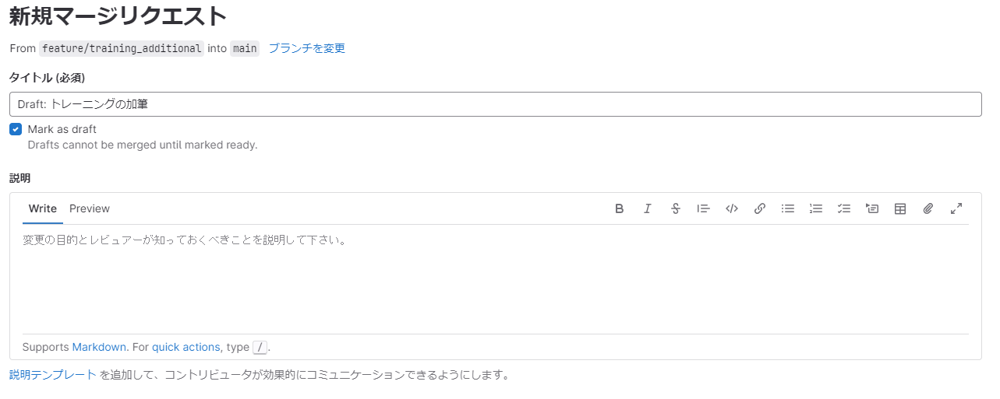
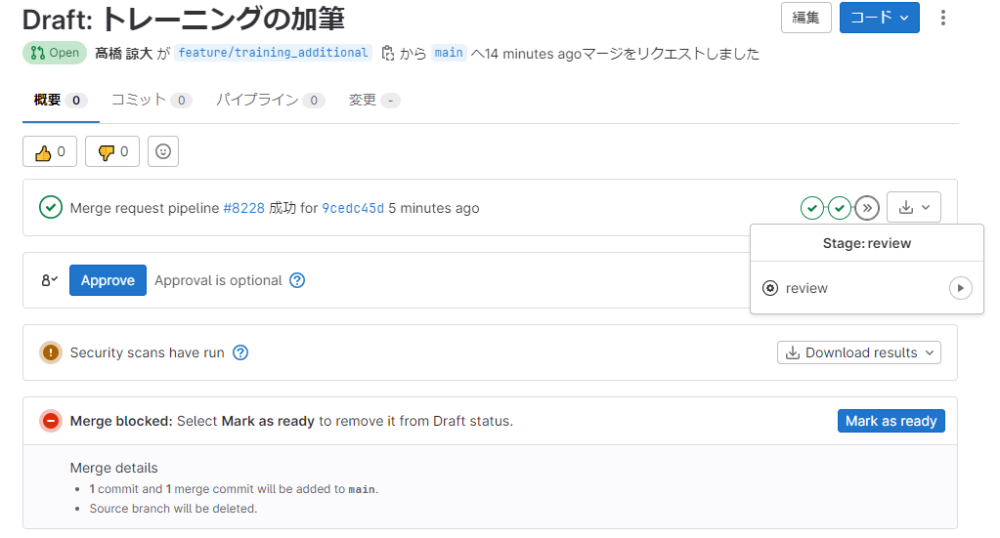
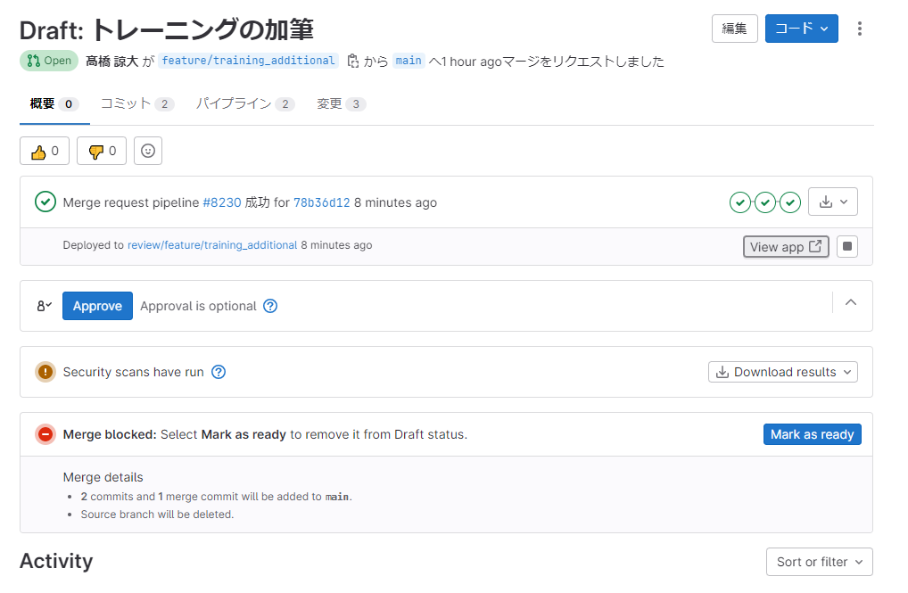
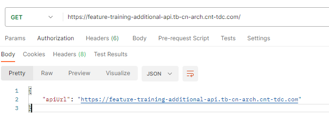
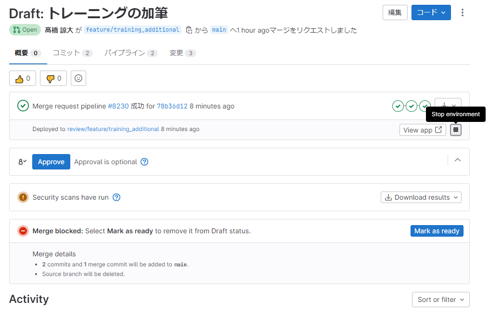

# デプロイ

ここでは、本番デプロイに関する説明を行っていきます。

## 初回手順

初回は Terraform コードを使ってベースとなる環境を作っていきます。  
この環境はデプロイ先を示すもので、Secret Manager と Systems Manager Parameter Store、後の手順で利用する Serverless FrameWork の Deployment Bucket(S3) を作っています。  
環境固有の変数はここからアクセスすることで、複数環境へのデプロイや、RV 環境の作成を実現しています。

また、実施するにあたってAWS CLIの設定が必要となります。下記公式ドキュメントを参考にしながら実施してください。
https://docs.aws.amazon.com/ja_jp/cli/latest/userguide/cli-chap-configure.html
（公式ドキュメントがわかりづらい場合は以下を参考にしてください）
https://dev.classmethod.jp/articles/aws-cli_initial_setting/

デプロイにはローカル環境で以下のコマンドを実行します。  
profile には AWS の profile 名、environment には環境の名前(`dev`や`prod`)を入れてください。  
(デフォルト値は[variable.tf](../../../terraform/service/variable.tf)参照)

```sh
cd terraform/service/
terraform init
terraform apply -var-file ./tfvars/dev.tfvars
```

### カスタムドメインについて

また、カスタムドメイン機能を利用される場合は、Route53 の HostZone をあらかじめ対応するドメイン名で作成してください。また、AWS Certificate Managerより、証明書の発行を行ってください。(推奨は`*.sub.yourdomain.example.com`のようにサブドメインに対しての証明書)  
発行手順は[こちらの記事](https://dev.classmethod.jp/articles/issuing-certificate-with-acm/)を参考にしてください。
利用されない場合は、[serverless.yml](./../../../serverless.yml)内の`custom.customDomain`の項目を削除して、`provider.httpApi.disableDefaultEndpoint`を`true`に変更してください。
S3 で tfstate を管理する方法については、[3-3. terraform.md](../3.Infrastructure/3.terraform.md)を参照してください。

## 通常のデプロイ手順

通常のアプリケーションのデプロイ手順は以下の 3 通りあります。

1. [デフォルトブランチにマージして、GitLab CI/CD 経由でデプロイ](#1-デフォルトブランチにマージしてgitlab-cicd-経由でデプロイ)
2. [MR を作成して、GitLab CI/CD 経由で review 環境をデプロイ(Beta)](#2-mr-を作成してgitlab-cicd-経由で-review-環境をデプロイbeta)
3. [ローカルからデプロイ(非推奨)](#3-ローカルからデプロイ非推奨)

### デプロイ先の環境について

このプロジェクトでは、デプロイ先環境を以下に分類しています。

- dev 環境
  - 安定版のアプリケーションを常にキープしておく環境で、開発中のアプリケーションの最新の状態が反映されているもの。
- review 環境
  - 作成した MR のレビュー・動作確認用などに使う環境。MR 毎に最大 1 つ作成することが出来、MR のクローズ(dev 環境へのマージ)時には破棄される一時的な環境。
- prod 環境
  - 本番稼働しているアプリケーションの環境。

### 1. デフォルトブランチにマージして、GitLab CI/CD 経由でデプロイ

1 つめはデフォルトブランチにマージして、GitLab CI/CD 経由でデプロイする方法です。  
この方法は、dev 環境などにデプロイする方法を意図して作成しています。  
デフォルトブランチは`リポジトリのURL/-/branches`から確認可能です。  
main や develop などをデフォルトブランチとして、dev 環境のものと一致させます。

デフォルトブランチにコードがプッシュ・マージされると、自動的に GitLab/CI が動き出し指定した環境へデプロイされます。  
このシード PJ では、main ブランチにマージすると dev 環境へデプロイされます。  
詳細は[.gitlab-ci.yml](../../../.gitlab-ci.yml)の`dev_deploy`をご覧ください。

### 2. MR を作成して、GitLab CI/CD 経由で review 環境をデプロイ(Beta)

2 つめは MR を作成して、GitLab CI/CD 経由で review 環境をデプロイする方法です。  
この方法は、開発時の RV 用環境や動作確認目的で別環境が欲しいときにデプロイする方法を意図して作成しています。

現在は Beta 版となっています。これは、環境の破棄時に上手く削除されないリソースがあるためです。
詳細は[.gitlab-ci.yml](../../../.gitlab-ci.yml)の`review`をご覧ください。

以下で手順を説明します。

1. MR を作成します。  
   

2. MR パイプラインの review ステージから review を実行します。  
   

3. 無事完了したら、`View app`で URL を取得できます。  
     
     
   URL はブランチ名がベースとなっています。  
   長すぎるブランチ名はデプロイに失敗する可能性がありますので注意してください。

4. MR をマージもしくは Close して環境を破棄します。
   手動で環境を停止したい際は`View app`隣の`Stop environment`を押してください。  
   押すと環境が破棄されます。
   

### 3. ローカルからデプロイ(非推奨)

3 つめは ローカルからデプロイする方法です。  
このシード PJ では、GitLab CI/CD 経由でデプロイすることを基本としているため、ローカルからデプロイすることは余り推奨していません。  
しかし、GitLab CI/CD が動作しなかったり、特殊な事情でローカルからデプロイしたい際はこちらをご利用ください。

本リポジトリ上の資材をそのままデプロイする場合、以下環境変数を任意の値に変更してください。

- 同一の値とすること

  - serverless.yml

  ```yml
  service: cnt-typescript-backend-aws-lambda
  ```

  - terraform/service/variable.tf

  ```tf
  variable "prefix_name" {
     default     = "cnt-typescript-backend-aws-lambda"
     type        = string
     description = "tag:Nameの前に付くprefix"
  }
  ```

- config/default.yml

```yml
shortPrefix: cnt-tomaru-test-tb-al
```

PJ のルートディレクトリで以下のコマンドを実行します。

```sh
npm run deploy
```

環境を破棄したいときは以下のコマンドを実行します。

```sh
npm run remove
```

#### .awsがない旨のエラーが表示された場合の対処

[初回手順](#初回手順)に記載されているAWS CLIの設定を実施してください。
