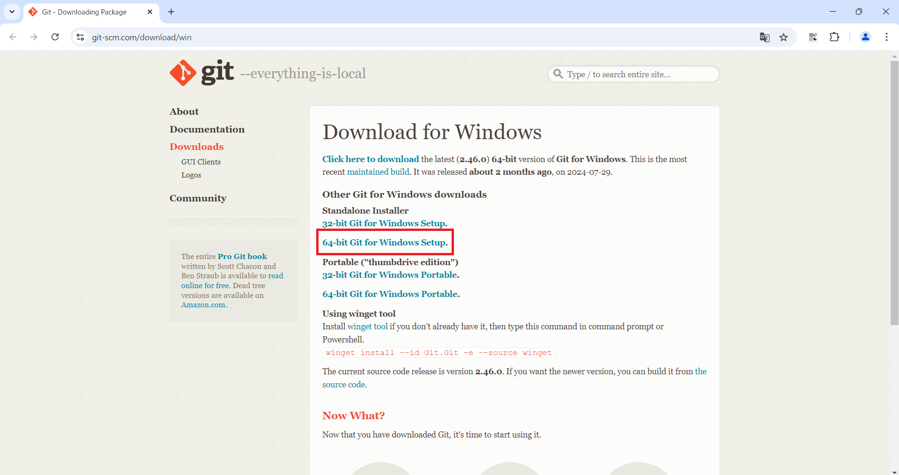
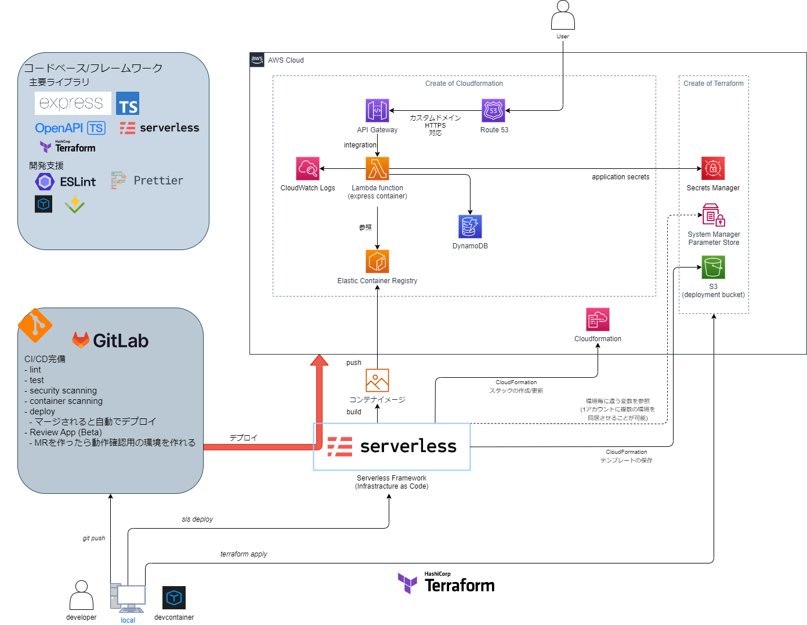
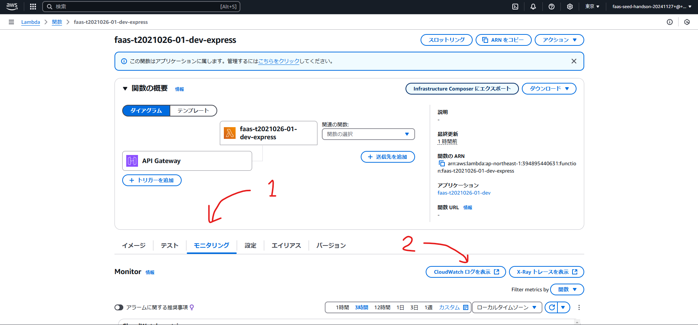

# 基礎編

<!--
テンションが上がる、理解度が上がるか
基準を設ける
ハンズオンでやる部分は網羅させるように見せる
(要議論)
-->

<!--
入り口として基本的にスクショは丁寧めに置く
ただし、メンテが不可能になりそうなものは載せない
また、執筆時のバージョンを載せておくことにより、サポートしやすくする
-->

## 開発環境構築

- 推奨スペック
  - 4コア以上のCPU
  - メモリ16GB
    - 8GBでも動作は可能です
- Rancher Desktop(WSL2)のインストールには管理者権限が必要です

### インストール

必要なツールのインストールをします

- Git

  - Windows: <https://git-scm.com/download/win>
    
    
  - Mac: <https://git-scm.com/download/mac>
  - メンテナが利用しているバージョン: `git version 2.45.2.windows.1`

インストール後に以下のコマンドを実行してください

- `git config --global core.autocrlf false`

- Rancher Desktop(WSL)

  - ※ただし、既にDocker Desktopをインストールしている場合は入れないようにしてください
  - <https://rancherdesktop.io/>
    
  - メンテナが利用しているバージョン: `1.95.1(user setup)`
  - インストール後にPCを*再起動*してください
    - ※再起動しないとRancher Desktopが起動しません

- Visual Studio Code

  - <https://code.visualstudio.com/>

- Visual Studio Code 拡張機能
  - devcontainer拡張機能`ms-vscode-remote.remote-containers`
    - 拡張機能から検索する場合は以下画面を参照してください
      - 
      - CLI でインストールする際は以下コマンドを実行してください
        - `code --install-extension ms-vscode-remote.remote-containers`

また、インストールが終わった時点で空き容量がぎりぎりではないか確認してください。10GBくらいは最低空けておいてください。

## リポジトリの整備

- 個人用(もしくはPJ用)のリポジトリを作成します。
  - [https://github.com/new](https://github.com/new)にアクセスしてください。(新規リポジトリの作成画面が開きます)
  - Ownerに自分のアカウント、Repository nameに任意の名前を入力し、リポジトリの可視性を`Private`にします。`Add a README file`にチェックを付け、`Create Repository`をクリックしてください。
    
- 上記手順で作成したリポジトリをローカルにcloneします。
  - HTTPSでクローンのURLをコピーします。
    
  - VSCodeを開き、下記コマンドを実行します。
    - `git clone <コピーしたURL>`
    - 下記のような表示があれば成功です。
      
      - 案件によってプロキシ設定を行っている場合は下記コマンドを実行してください。
        - `git clone -c http.proxy="" <コピーしたURL>`
- アセットファイルを先ほど作成したリポジトリに反映します。

  - [FaaSシードのリポジトリのリリースページ](https://repos.tdctechsupport.com/dt-guilds/container/techbeyond-cna-assets/typescript-backend-aws-lambda-handson/-/releases)から*最新のリリースバージョン*をzipでダウンロードし、先ほど作成したリポジトリのディレクトリに解凍した中身をすべて移動します。
    
    
  - Visual Studio Codeでリポジトリのディレクトリを開きます
    
  - 個人用リポジトリに反映します。

    - CLIの場合は以下

    ```sh
      git add .
      git commit -m "リポジトリの新規作成"
      git push
    ```

    - この時認証エラーなどが発生した場合は下記コマンドを実行してください。

    ```
      git commit -m "リポジトリの新規作成" --no-verify
      git push --no-verify
    ```

### devcontainerの起動

(VSCodeのスクショも貼りたいかもしれない)
`Rancher Desktop`を起動後、VSCode の左下の`><`ボタンを押下し、`Reopen in Container`を押下することで起動することができます。

## 初回デプロイ(手動)

クラウドへのサービスのデプロイは[Terraform](https://www.terraform.io/)と[Serverless Framework](https://www.serverless.com/)を使用します。

### アーキテクチャ図

FaaSシードは以下のアーキテクチャで構成されています。
ここからはこれらのサービスをデプロイしていきます。



### AWS アクセスキーの取得(ハンズオン)

まずは、事前に配布されたユーザーネームとパスワードで、AWSマネジメントコンソールにサインインします。
以下のURLにアクセスしてください。

サインインすると、パスワードの変更画面がでる場合がありますが、その際は変更してください。
その後は、以下の手順に従ってアクセスキーを払い出してください。
<https://docs.aws.amazon.com/ja_jp/IAM/latest/UserGuide/access-key-self-managed.html#Using_CreateAccessKey>

ユースケースは今回はAWS CLIを利用するので、CLIを選び、チェックボックスにチェックを付けて進めてください。


### AWS CLIの設定

以下のコマンドを実行して、対話形式で認証情報を設定します。

```sh
aws configure

# {アクセスキーID}と{シークレットアクセスキー}は
# 自分のアクセスキーIDとシークレットアクセスキーに置き換えて下さい。

AWS Access Key ID [None]: {アクセスキーID}
AWS Secret Access Key [None]: {シークレットアクセスキー}
Default region name [None]: ap-northeast-1
Default output format [None]: json
```

~/.aws/credentialsで認証情報プロファイルを確認できます。

```sh
cat ~/.aws/credentials
```

出力

```ini
[default]
aws_access_key_id = {アクセスキーID}
aws_secret_access_key = {シークレットアクセスキー}
```

※{アクセスキーID}と{シークレットアクセスキー}には自身で設定した内容が代入されて表示されます。

- 公式: <https://docs.aws.amazon.com/ja_jp/cli/latest/userguide/cli-configure-files.html#cli-configure-files-methods>

また、多くの環境ではスイッチロールの設定が必要になります。
スイッチロールの設定には、`~/.aws/config`に以下のように追記します。
ファイルの編集は`code ~/.aws/config`で可能です。

```ini
[profile handson]
region=ap-northeast-1
role_arn=arn:aws:iam::394895440631:role/faas-seed-handson2250228
source_profile=default
cli_pager=
```

そして、bashにて`AWS_PROFILE`環境変数を設定します。

```sh
export AWS_PROFILE=handson
```

これにより、ハンズオンに使用するAWSアカウントでコマンドなどが実行できるようになります。

```sh
aws sts get-caller-identity
```

### サービス名の設定

<!--関係ないけど証明書の発行はTerraform化したいかもしれない-->

<!-- (講師側事前準備)
\*.faas-handson.cnt-tdc.comとかでCertificate発行 + Route53準備？
dev-api-t2021026.faas-handson.cnt-tdc.comとかを利用者には使ってもらう
-->

初回デプロイ前に、各個人によって異なるサービス名やドメインの設定を行っていきます。
以下のファイルの値を書き替えてください。

`#{社員番号}`は自身の社員番号に置き換えてください。
例: `faas-#{社員番号}` → `faas-t2021026`

- serverless.yml

  ```diff
  - service: cnt-typescript-backend-aws-lambda
  + service: faas-#{社員番号}
  ```

- terraform/service/variable.tf

  ```diff
   variable "prefix_name" {
  -   default     = "cnt-typescript-backend-aws-lambda"
  +   default     = "faas-#{社員番号}"
  -   description = "tag:Nameの前に付くprefix"
  +   description = "tag:Nameの前に付くprefix"
   }
  ```

- config/default.yml, config/dev.yml, config/prod.yml

  ```diff
  - shortPrefix: cnt-tb-al
  + shortPrefix: faas-#{社員番号}
  ```

- serverless.yml

  ```diff
   customDomain:
  -   domainName: ${sls:stage}-api.tb-cn-arch.cnt-tdc.com
  +   domainName: ${sls:stage}-api-#{社員番号}.faas-handson.cnt-tdc.com
  -   certificateName: "*.tb-cn-arch.cnt-tdc.com"
  +   certificateName: "*.faas-handson.cnt-tdc.com"
  ```

- .github/workflows/check.yml

  ```diff
   build:
     uses: ./.github/workflows/build_and_push.yml
     needs: [lint, test]
     permissions:
       id-token: write
       contents: read
     with:
  -    repository: ${{ vars.ECR_EXPRESS_REPOSITORY }}
  -    assume_role: ${{ vars.DEV_ASSUME_ROLE_ARN }}
  -    aws_region: ${{ vars.DEV_AWS_REGION }}
  +    repository: faas-#{社員番号}-lambda-repository-dev
  +    assume_role: arn:aws:iam::394895440631:role/faas-#{社員番号}-github-oidc
  +    aws_region: ap-northeast-1
  ```

- .github/workflows/dev_deploy.yml

  ```diff
   serverless_deploy:
     needs: convert_head_ref_name
     uses: ./.github/workflows/deploy.yml
     permissions:
       id-token: write
       contents: read
       actions: read
     with:
       env: dev
       artifact: ${{ needs.convert_head_ref_name.outputs.converted }}
  -    assume_role: ${{ vars.DEV_ASSUME_ROLE_ARN }}
  -    aws_region: ${{ vars.DEV_AWS_REGION }}
  -    app_domain: ${{ vars.DEV_APP_DOMAIN }}
  +    assume_role: arn:aws:iam::394895440631:role/faas-#{社員番号}-github-oidc
  +    aws_region: ap-northeast-1
  +    app_domain: -api.#{社員番号}.faas-handson.cnt-tdc.com
  ```

- .github/workflows/review_deploy.yml

  ```diff
   serverless_deploy:
     needs: convert_head_ref_name
     uses: ./.github/workflows/deploy.yml
     permissions:
       id-token: write
       contents: read
       actions: read
     with:
       env: dev
       artifact: ${{ needs.convert_head_ref_name.outputs.converted }}
  -    assume_role: ${{ vars.DEV_ASSUME_ROLE_ARN }}
  -    aws_region: ${{ vars.DEV_AWS_REGION }}
  -    app_domain: ${{ vars.DEV_APP_DOMAIN }}
  +    assume_role: arn:aws:iam::394895440631:role/faas-#{社員番号}-github-oidc
  +    aws_region: ap-northeast-1
  +    app_domain: -api.#{社員番号}.faas-handson.cnt-tdc.com
  ```

- .github/workflows/review_remove.yml

  ```diff
   serverless_deploy:
     needs: convert_head_ref_name
     uses: ./.github/workflows/remove.yml
     permissions:
       id-token: write
       contents: read
       actions: read
     with:
       env: dev
       artifact: ${{ needs.convert_head_ref_name.outputs.converted }}
  -    assume_role: ${{ vars.DEV_ASSUME_ROLE_ARN }}
  -    aws_region: ${{ vars.DEV_AWS_REGION }}
  -    app_domain: ${{ vars.DEV_APP_DOMAIN }}
  +    assume_role: arn:aws:iam::394895440631:role/faas-#{社員番号}-github-oidc
  +    aws_region: ap-northeast-1
  +    app_domain: -api.#{社員番号}.faas-handson.cnt-tdc.com
  ```

- 補足
  - 本来カスタムドメインを利用するときは、Route53のホストゾーンとAWS Certificate Manager(ACM)の証明書が必要になります。証明書の発行に関して詳しくは、[deploy.md](../2.application/4.deploy.md#カスタムドメインについて)を参照してください。ハンズオンでは、手順の簡略化のため、事前に発行したものを利用しています。

### 実行

#### Terraform

まず、Serverless Frameworkで管理しないリソースを[Terraform](https://www.terraform.io/)を利用してデプロイします。

```sh
cd terraform/service/
terraform init
# terraform plan
terraform apply -var-file ./tfvars/dev.tfvars
```

#### Docker

次に、Lambdaで利用するコンテナイメージをビルドします。ビルドしたイメージは先ほどTerraformでデプロイしたECRにpushするため、ECRのページを開き、プッシュコマンドを表示して実行しましょう。

まず、配布したAWSアカウントにログインした状態で、[こちら](https://signin.aws.amazon.com/switchrole?roleName=faas-seed-handson-20241127&account=techbeyond-fv02)にアクセスし、ハンズオンで使うアカウントのロールにスイッチロールします。
その後、ECRのリポジトリのページを開きます。


自身の社員番号を含むリポジトリを選択し、プッシュコマンドの表示をクリックすると、以下のようなダイアログが出てくるので、ここに従ってビルド & プッシュを実行します。(Windowsユーザーの方も macOS/Linuxの手順を使ってください。)


#### Serverless Framework

最後に[Serverless Framework](https://www.serverless.com/)を利用してLambdaやAPI Gateway等のデプロイを行います。

```sh
npm run deploy -- --stage dev --param "imageTag=:latest"
```

### 結果

それでは、デプロイしたアプリを確認しましょう。
まずは、先ほどのコマンドで出力された中の`DomainName`のURLにHTTPを付けてアクセスしてみましょう。

以下のようにapiのURLがそのまま帰ってくるようなAPIが実行されます。
この処理は、`src/app/route/index.ts`に実装されており、他にも`/hello`等のエンドポイントも実際に実行できる様子が分かります。


では、アプリ自体の確認ができたところで、実際にデプロイしたリソースと、ログを見に行きましょう。
AWSマネジメントコンソールの画面で Lambdaに行き、自身が作成したリソースの末尾に`express`とついている物を開きます。(例: `faas-t2021026-dev-express`)
このように自分のAPIに利用しているLambdaデプロイされていることが分かります。
モニタリングのタブに行き、`CloudWatchログを表示`のボタンを押しましょう。

ログストリームを選択すると以下のようにログが出力されていることが分かります。


## アプリの変更

### エンドポイント実装

参考資料: [app-implement.md](../1.coding/2.app-implement.md)

今回は試しに、アルファベットの文字列を受け取って大文字にして返す、 `/uppercase`エンドポイントを実装してみましょう。

#### openapi.json編集

OpenAPIの定義は以下の通りです。以下から必要な部分を抜き出し、`src/app/openapi.json`に追加してみましょう。

```json
{
  "openapi": "3.0.0",
  "info": {
    "title": "Uppercase API",
    "version": "1.0.0"
  },
  "paths": {
    "/uppercase": {
      "post": {
        "summary": "UpperCaseに変換します",
        "operationId": "convertToUppercase",
        "requestBody": {
          "required": true,
          "content": {
            "application/json": {
              "schema": {
                "type": "object",
                "properties": {
                  "input": {
                    "type": "string",
                    "description": "UpperCaseに変換する対象の文字列",
                    "example": "hello world"
                  }
                },
                "required": ["input"]
              }
            }
          }
        },
        "responses": {
          "200": {
            "description": "UpperCase成功時",
            "content": {
              "application/json": {
                "schema": {
                  "type": "object",
                  "properties": {
                    "output": {
                      "type": "string",
                      "description": "UpperCase変換後文字列",
                      "example": "HELLO WORLD"
                    }
                  }
                }
              }
            }
          }
        }
      }
    }
  }
}
```

#### 実装

OpenAPIの定義の追加が終わったら、処理の実装に入ります。まずは更新したOpenAPI定義からTypeScriptでリクエスト/レスポンスの型を生成する為、以下のコマンドを実行します。

```sh
npm run generate-api-types
```

`src/app/route/uppercase.ts`のファイルを作り、以下のテンプレートに、UpperCaseに変換する処理をくわえてみましょう。

```ts
import type { ApiHandler } from "@/app/HandlerTypes.js";
import { logger } from "@/utils/logger.js";

export default function () {
  const post: ApiHandler<"/uppercase", "post"> = function (req, res) {
    logger.info(req.body);

    res.status(200).json({
      output: "test",
    });
  };

  return {
    post,
  };
}
```

※ コーディング中によくわからないエラーが表示されるときはVSCodeのコマンドパレットからTSサーバーやESlintサーバーを再起動すると直る場合があります。
`Ctrl` + `Shift` + `P` → `TS` や `ESLint`と打ち込み、以下の画像の2つを選ぶ。


## ローカル実行

参考資料: [app-execution.md](../1.coding/3.app-execution.md)

実装したらそのエンドポイントの動作確認をする必要があります。まずは、ローカルで起動して確認してみましょう。
ローカルで実行するコマンドは以下です。

```sh
npm run dev
```

これによりローカルで開発サーバーが起動します。この開発サーバーはdevcontainer内だけでなく、ローカルのホスト側(Windows/Mac)側からも接続が出来ます。
URLは基本的には`http://localhost:3000`になります。
テストするリクエストを送るツールにはPostman等でも良いですが、ここでは、bashでcurlコマンドでテストする記法とPowerShellでテストする記法を示します。

- curl

```sh
curl -X POST "http://localhost:3000/uppercase" \
     -H "Content-Type: application/json" \
     -d '{"input": "hello world"}'
```

- powershell

```powershell
Invoke-WebRequest -Uri "http://localhost:3000/uppercase" -Method Post -ContentType "application/json" -Body '{"input": "hello world"}'
```

## CICDでのデプロイ

実装が終わったらいよいよデプロイして、環境に反映させてみましょう。
ローカルでのデプロイもできますが、ここでは、CI/CDによるデプロイを試します。

### mainにcommit/マージしてデプロイ

では、先ほどの変更をコミットして、mainにpushしましょう。本来複数人での開発の場合は、新しくブランチを切り、MR(マージリクエスト)を発行してmainにマージするという流れですが、今回は、直接コミットし、pushします。
CLI/VSCodeどちらでも構いませんのでお好みの手順でpushまで行ってください。

- GitHub Actions上のログについて
  GitHub 上の`Actions`タブから完了している`dev deploy`workflowのログから確認できます。

  1. 最初に作成したGitHubの個人用(もしくはPJ用)のリポジトリの「Actions」タブからGitHub Actionsの実行履歴画面を表示し、「dev deploy」と表示されている履歴をクリックします。
  
  1. 「serverless_deploy」と表示されているジョブをクリックします
  
  1. 「Deploy to dev environment」と表示されているアコーディオンをクリックし、ログを確認します。
  

デプロイが完了したら、デプロイしたアプリに向かってもリクエストを投げてみましょう。[結果](#結果)のセクションのように、URLのドメインを取り出し、例えば以下のようにリクエストを送ります。

- curl

```sh
curl -X POST "https://dev-api-t2021026-01.faas-handson.cnt-tdc.com/uppercase" \
     -H "Content-Type: application/json" \
     -d '{"input": "hello world"}'
```

- powershell

```powershell
Invoke-WebRequest -Uri "https://dev-api-t2021026-01.faas-handson.cnt-tdc.com/uppercase" -Method Post -ContentType "application/json" -Body '{"input": "hello world"}'
```

### 終了時

ハンズオンを終える際や、サービスの提供を終了する際は、以下のコマンドでデプロイしているサービスを削除してください。

```sh
# serverless framework
npm run remove -- --stage dev --param "imageTag=:latest"

# terraform(service)
cd terraform/service/
# ハンズオンの際はinit不要
terraform init
terraform destroy -var-file ./tfvars/dev.tfvars

# 元のディレクトリに戻す
cd -

# terraform(gitlab-runner)
cd terraform/gitlab-runner/
# ハンズオンの際はinit不要
terraform init
terraform destroy -var-file ./default.tfvars
```
