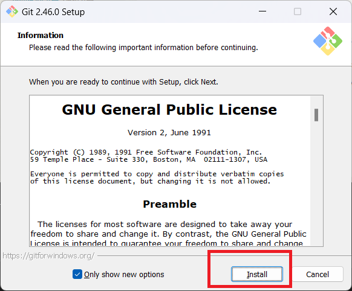
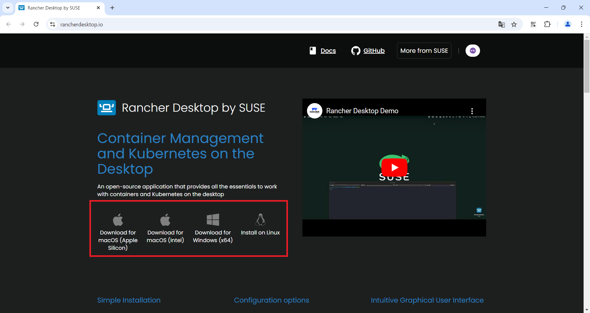

# ハンズオン用事前セットアップ

ハンズオンの受講前に事前に対応していただきたい項目が2つあります。

- 全社共有リポジトリへのログイン
- 開発環境構築

## GitHubへのアカウント作成（未作成の方）

今回のハンズオンでは[GitHub](https://github.com)を利用します。

- アカウントを持っていない方は、TDCソフトのメールアカウント(`***@tdc.co.jp`)を利用しアカウントを作成してください。
- アカウント作成後、[2 要素認証を設定する](https://docs.github.com/ja/authentication/securing-your-account-with-two-factor-authentication-2fa/configuring-two-factor-authentication#configuring-two-factor-authentication-using-a-totp-app)を参考にし、二要素認証を有効化してください。

## 開発環境構築

- 推奨スペック
  - 4コア以上のCPU
  - メモリ16GB
    - 8GBでも動作は可能です
- Rancher Desktop(WSL2)のインストールには管理者権限が必要です

### インストール

必要なツールのインストールをします

- Git

  - Windows: <https://git-scm.com/download/win>
    
    
  - Mac: <https://git-scm.com/download/mac>
  - メンテナが利用しているバージョン: `git version 2.45.2.windows.1`

インストール後に以下のコマンドを実行してください

- `git config --global core.autocrlf false`

- Rancher Desktop(WSL)

  - ※ただし、既にDocker Desktopをインストールしている場合は入れないようにしてください
  - <https://rancherdesktop.io/>
    
  - メンテナが利用しているバージョン: `1.17.1`
  - 2025/02/28時点最新の`1.18.0`では、上手く動作しない不具合が報告されているため、[1.17.1のリリースページ](https://github.com/rancher-sandbox/rancher-desktop/releases/tag/v1.17.1)より`1.17.1`をインストールすることを推奨します。

- Visual Studio Code

  - <https://code.visualstudio.com/>
  - メンテナが利用しているバージョン: `1.97.2(user setup)`
    - 自動更新で最新にしています

- Visual Studio Code 拡張機能
  - devcontainer拡張機能`ms-vscode-remote.remote-containers`
    - 拡張機能から検索する場合は以下画面を参照してください
      
      - CLI でインストールする際は以下コマンドを実行してください
        - `code --install-extension ms-vscode-remote.remote-containers`

また、インストールが終わった時点で空き容量がぎりぎりではないか確認してください。10GBくらいは最低空けておいてください。
